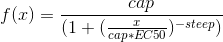

# Knapsack-solver

knapsack is a free, open source package for solving knapsack problems. It was originally used to optimize budgets for ad campaigns.

Base value objects are parametrized response functions in form:

See [example.py](example.py) for demo.

You can write your own response functions, but they must have following methods properties:
* `__call__` method, which will return single numeric value
* `fun` property, that will return callable that represent your function
* `derivative` property, that will return callable that represent your function derivative

